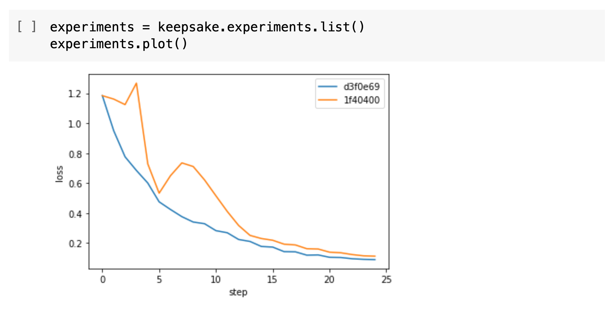

# 📣 This project is not actively maintained. If you'd like to help maintain it, please [let us know](https://github.com/replicate/keepsake/issues/873).

---

# Keepsake

Version control for machine learning.

Keepsake is a Python library that uploads files and metadata (like hyperparameters) to Amazon S3 or Google Cloud Storage. You can get the data back out using the command-line interface or a notebook.

- **Track experiments:** Automatically track code, hyperparameters, training data, weights, metrics, Python dependencies — _everything_.
- **Go back in time:** Get back the code and weights from any checkpoint if you need to replicate your results or commit to Git after the fact.
- **Version your models:** Model weights are stored on your own Amazon S3 or Google Cloud bucket, so it's really easy to feed them into production systems.

## How it works

Just add two lines to your training code:

```python
import torch
import keepsake

def train():
    # Save training code and hyperparameters
    experiment = keepsake.init(path=".", params={...})
    model = Model()

    for epoch in range(num_epochs):
        # ...

        torch.save(model, "model.pth")
        # Save model weights and metrics
        experiment.checkpoint(path="model.pth", metrics={...})
```

Then Keepsake will start tracking everything: code, hyperparameters, training data, weights, metrics, Python dependencies, and so on.

- **Open source & community-built:** We’re trying to pull together the ML community so we can build this foundational piece of technology together.
- **You're in control of your data:** All the data is stored on your own Amazon S3 or Google Cloud Storage as plain old files. There's no server to run.
- **It works with everything:** Tensorflow, PyTorch, scikit-learn, XGBoost, you name it. It's just saving files and dictionaries – export however you want.

## Features

### Throw away your spreadsheet

Your experiments are all in one place, with filter and sort. Because the data's stored on S3, you can even see experiments that were run on other machines.

```shell-session
$ keepsake ls --filter "val_loss<0.2"
EXPERIMENT   HOST         STATUS    BEST CHECKPOINT
e510303      10.52.2.23   stopped   49668cb (val_loss=0.1484)
9e97e07      10.52.7.11   running   41f0c60 (val_loss=0.1989)
```

### Analyze in a notebook

Don't like the CLI? No problem. You can retrieve, analyze, and plot your results from within a notebook. Think of it like a programmable Tensorboard.



### Compare experiments

It diffs everything, all the way down to versions of dependencies, just in case that latest Tensorflow version did something weird.

```shell-session
$ keepsake diff 49668cb 41f0c60
Checkpoint:       49668cb     41f0c60
Experiment:       e510303     9e97e07

Params
learning_rate:    0.001       0.002

Python Packages
tensorflow:       2.3.0       2.3.1

Metrics
train_loss:       0.4626      0.8155
train_accuracy:   0.7909      0.7254
val_loss:         0.1484      0.1989
val_accuracy:     0.9607      0.9411
```

### Commit to Git, after the fact

If you eventually want to store your code on Git, there's no need to
commit everything as you go. Keepsake lets you get back to any
point you called `experiment.checkpoint()` so, you can
commit to Git once you've found something that works.

```shell-session
$ keepsake checkout f81069d
Copying code and weights to working directory...

# save the code to git
$ git commit -am "Use hinge loss"
```

### Load models in production

You can use Keepsake to feed your models into production systems. Connect them back to how they were trained, who trained them, and what their metrics were.

```python
import keepsake
model = torch.load(keepsake.experiments.get("e45a203").best().open("model.pth"))
```

## Install

```
pip install -U keepsake
```

## Get started

If you prefer **training scripts and the CLI**, [follow the our tutorial to learn how Keepsake works](https://keepsake.ai/docs/tutorial).

If you prefer **working in notebooks**, <a href="https://keepsake.ai/docs/notebook-tutorial" target="_blank">follow our notebook tutorial on Colab</a>.

If you like to **learn concepts first**, [read our guide about how Keepsake works](https://keepsake.ai/docs/learn/how-it-works).

## Get involved

Everyone uses version control for software, but it is much less common in machine learning.

Why is this? We spent a year talking to people in the ML community and this is what we found out:

- **Git doesn’t work well with machine learning.** It can’t handle large files, it can’t handle key/value metadata like metrics, and it can’t commit automatically in your training script. There are some solutions for this, but they feel like band-aids.
- **It should be open source.** There are a number of proprietary solutions, but something so foundational needs to be built by and for the ML community.
- **It needs to be small, easy to use, and extensible.** We found people struggling to integrate with “AI Platforms”. We want to make a tool that does one thing well and can be combined with other tools to produce the system you need.

We think the ML community needs a good version control system. But, version control systems are complex, and to make this a reality we need your help.

Have you strung together some shell scripts to build this for yourself? Are you interested in the problem of making machine learning reproducible?

Here are some ways you can help out:

- [Join our Discord to chat to us and other contributors.](https://discord.gg/QmzJApGjyE)
- [Have your say about what you want from a version control system on our public roadmap.](https://github.com/replicate/keepsake/projects/1)
- [Try your hand at one of our issues labelled "help wanted".](https://github.com/replicate/keepsake/labels/help%20wanted)

## Contributing & development environment

[Take a look at our contributing instructions.](CONTRIBUTING.md)
